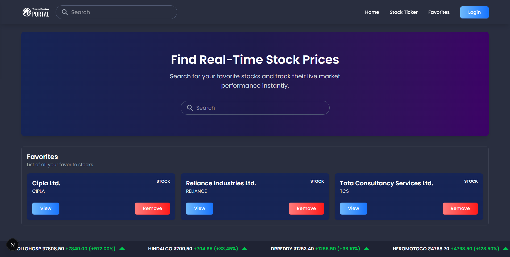
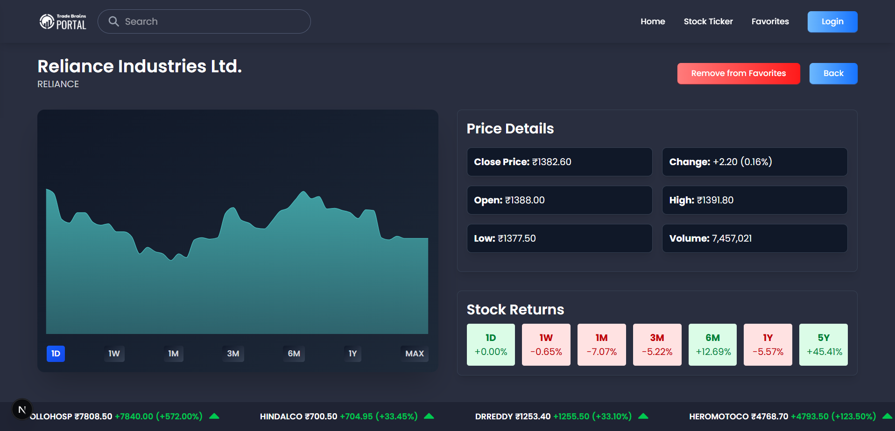

# TradeBrains Stock Ticker

A modern stock ticker application built with **Next.js** and **TypeScript**, inspired by [portal.tradebrains.in](https://portal.tradebrains.in). This app allows users to search for stocks, view detailed stock information, and analyze price data with interactive graphs.

---

## Features

- **Stock Search Functionality**: Quickly find any stock using the search bar.
- **Stock Details Page**: View detailed information about individual stocks.
- **Stock Graph**: Interactive graph displaying stock price data over time.
- **Favorites**: Mark your favorite stocks for quick access.
- **SEO Optimized**: Proper meta tags and SEO-friendly pages for each stock.
- **Responsive Design**: Fully responsive layout for all devices.

---

## Screenshots

- **Home Page**
  

- **Stock Details Page**
  

---

## Live Demo

[View Live Application](https://tradebrains-stock-ticker.vercel.app/)

## Repository

[GitHub Repository](https://github.com/amankashyap004/tradebrains-stock-ticker)

---

## Installation & Running Locally

1. **Clone the Repository**

```bash
git clone https://github.com/amankashyap004/tradebrains-stock-ticker.git
cd tradebrains-stock-ticker
```

2. **Install Dependencies**

```bash
npm install
# or
yarn install
```

3. **Run Development Server**

```bash
npm run dev
# or
yarn dev
```

Open [http://localhost:3000](http://localhost:3000) to view the app in your browser.

---

## Directory Structure

```
tradebrains-stock-ticker/
├── public/
│   └── images/
├── src/
│   ├── app/
│   │   ├── globals.css
│   │   ├── favicon.ico
│   │   ├── layout.tsx
│   │   ├── not-found.tsx
│   │   ├── page.tsx
│   │   └── stock/
│   │       └── [symbol]/
│   │           └── page.tsx
│   ├── components/
│   │   ├── Favorites.tsx
│   │   ├── SearchBar.tsx
│   │   ├── StockGraph.tsx
│   │   ├── TickerBar.tsx
│   │   ├── common/
│   │   │   ├── Container.tsx
│   │   │   ├── Header.tsx
│   │   │   └── Loading.tsx
│   │   ├── errors/
│   │   │   ├── ApiError.tsx
│   │   │   ├── NotFound.tsx
│   │   │   └── StockError.tsx
│   │   └── ui/
│   │       └── Button.tsx
│   ├── context/
│   │   └── FavoritesContext.tsx
│   ├── types/
│   │   └── index.ts
│   └── utils/
│       └── api.ts
├── .gitignore
├── README.md
├── eslint.config.mjs
├── next.config.ts
├── package.json
├── postcss.config.mjs
└── tsconfig.json
```

---

## Technologies Used

- **Frameworks & Libraries**:

  - **Next.js:** React framework for server-side rendering and static sites
  - **React:** Front-end UI library
  - **Recharts:** Charting library for stock graph
  - **React Fast Marquee:** Animated ticker component
  - **React Icons:** Icon library
  - **Axios:** HTTP client for API requests

- **Languages**: TypeScript, JavaScript
- **Styling**: Tailwind CSS

---

## License

This project is licensed under the MIT License.
